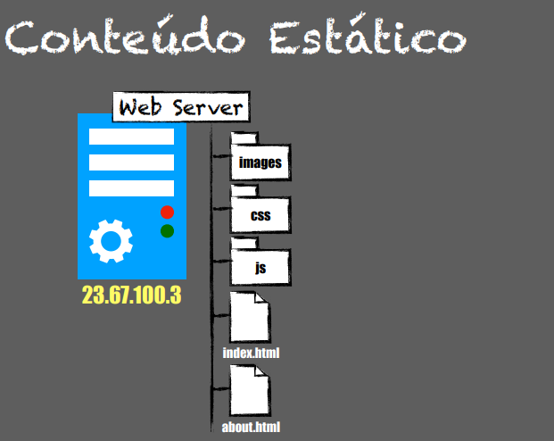
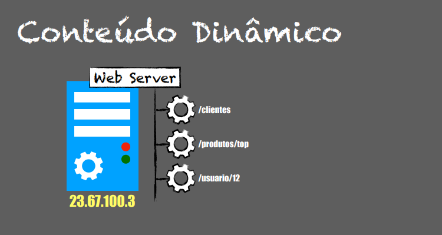

# Estático Vs Dinâmico

**Conteúdo Estático**

Se precisar renderizar a página apenas arquivos que foram armazenados no disco do servidor web significa que esse conteúdo é estático. 
Ex: html,css,js

-----

**Conteúdo Dinâmico**

Caso você queira gerar uma lista de clientes, quais os produtos mais vendidos ou pegar um determinado usuário. Então no caso você precisa de serviços que estão no back-end que gera o conteúdo dinâmico.