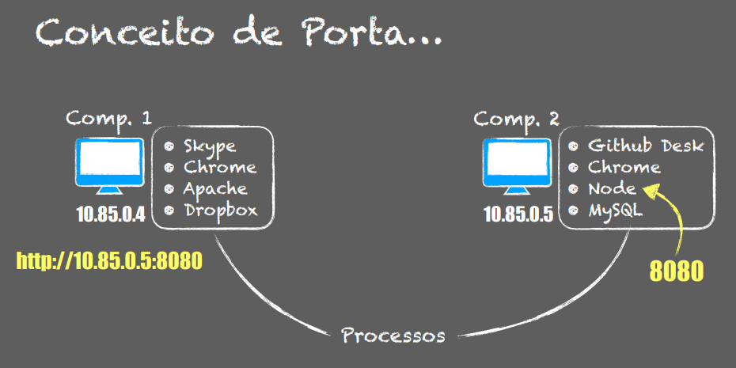

# Introdução

**Topologias**
Centralizada: todos os computadores estão conectados em um switch e em um único computador consegue gerenciar os demais computadores

Distribuída: é a topologia assuimda pela internet. Não existe um poder central em cima da internet. Na verdade é um poder de todos e muita gente distribui existe vários assuntos modernos e que se discutem sobre a neutralidade de rede.

---------

**Protocolos**
TCP: Transmission Control Protocol(Orientado a conexão e confiável)
IP: Internet Protocol(Roteamento entre redes)

----------
**Camadas**

Camadas: Aplicação -> Transporte -> Internet -> Rede/Física
(A camada de aplicação depende da de transporte assim sucessivamente) 

Rede/Física
- Ethernet, Wi-Fi
- MAC address
- Física(hardware) e Enlance(Software)

Internet
- IP: Internet Protocol
- Conexão entre redes
- Transferência de Pacotes

Transporte
- TCP(Confiável), UDP(Melhor esforço)
- Comunicação Hots-a-Host
- Confiabilidade, Integridade

Aplicação 
- HTTP, FTP, SMTP
- Comunicação Processo-a-Processo
- Número da porta
--------

**Anatomia do IPv4**
Classe A: 192.168.100.230
        (Rede)/(  Host  )
          255.0.0.0
Classe B: 192.168.100.230
          (Rede )/( Host )
          255.255.0.0
Classe C: 192.168.100.230
          (  Rede  )/(Host)
          255.255.255.0

--------------------
**Conceito de Porta**
Comp.1: 10.85.04
Comp.2: 10.85.05
Precisa saber o IP e o processo que você quer utilizar e esse processo é mapeado pela porta
