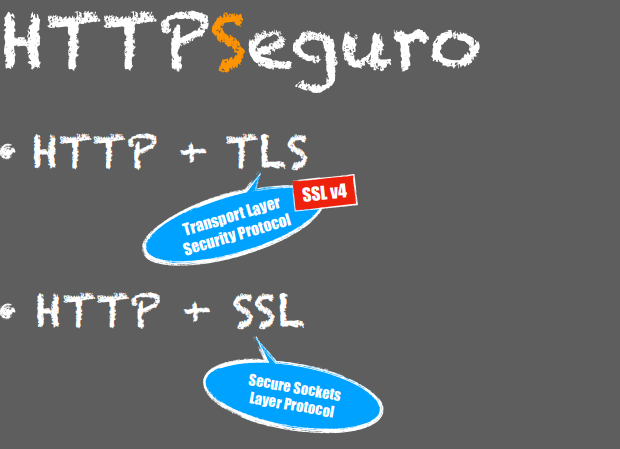
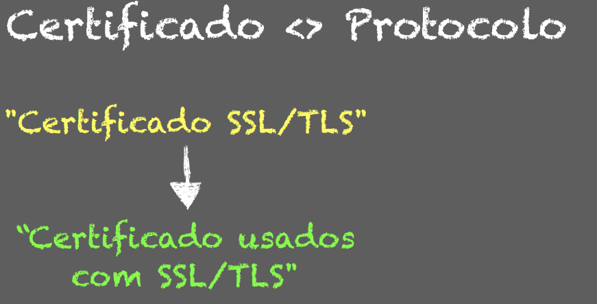
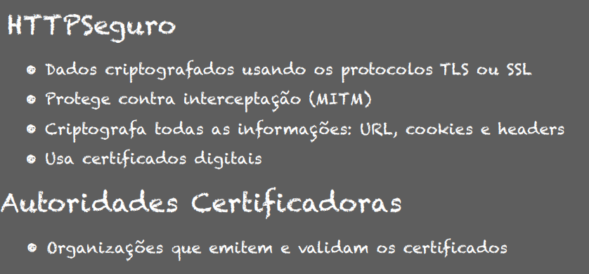

# Protocolo HTTPS

HyperText Transfer Protocol Secure

TLS: Transport Layer Security Protocol
SSL: Secure Sockets Layer Protocol

-----
**Certificado é diferente de Protocolo**

----
**HTTPSeguro**
Https
• Dados criptografados usando os protocolos TLS ou SSL 
• Protege contra interceptação (MITM) 
• Criptografa todas as informações: URL, cookies e headers 
• Usa certificados digitais
Autoridades Certificadoras
• Organizações que emitem e validam os certificados(Let's Encrypt, CertBot)

