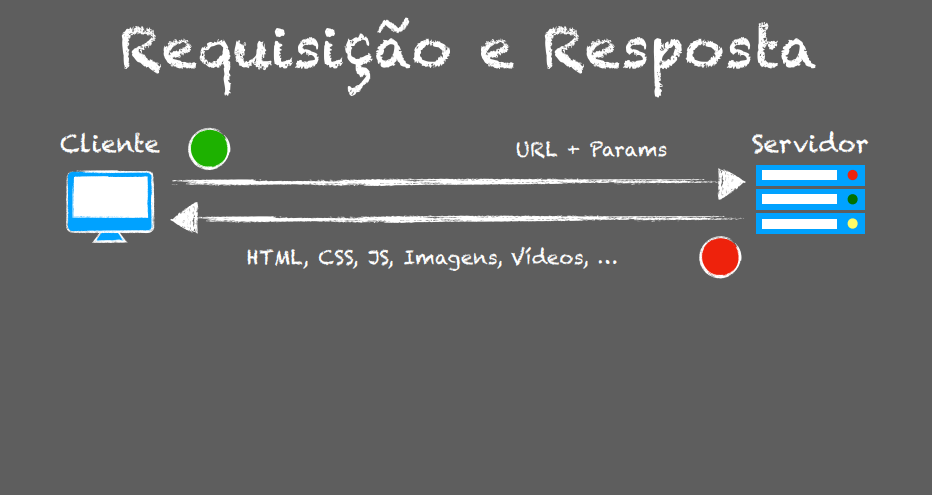

# Protocolo HTTP
HyperText Transfer Protocol (textos linkados)

**Características**: 
- Está na camada de aplicação 
- Stateless: quando uma máquina manda uma requisição http para um servidor, é como se estivessem fazendo a comunicação pela primeira vez por que dentro do protocolo em si não existe estado da conversação.
- Relação cliente-servidor: conceito de requisição e resposta eu mando uma requisição baseado na URL com um conjunto de parâmetros e recebo uma resposta(Html,vídeo,JSON).
- TCP/IP
- HTML,CSS,JS,Mídias: vai retornar conteúdos para formar uma página web.
--------------
**Fluxo**
1º Usuário informa a URL
2º Browser gera a requisição. Ex: www.google.com.br
3º Servidor Web gera a resposta
4º Browser exibe a página

------------
**Métodos HTTP**
- Get - Retorna dados
- Post - Adiciona dados
- Put - Altera dados
- Delete - Remove dados
- Options -
- Trace -
- Connect -  
- Head - 
-------
**Requisição e Resposta**

----
**Requisição via Get**

--------
**Requisição via Post**

------
**Grupos de Status HTTP**
