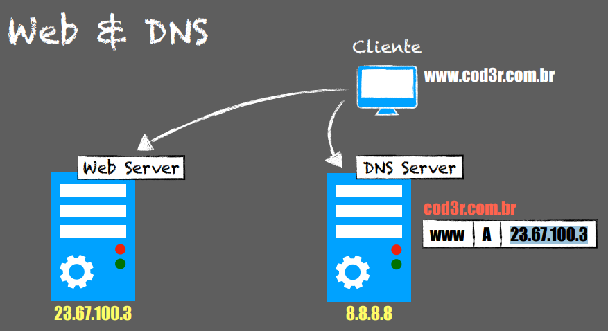
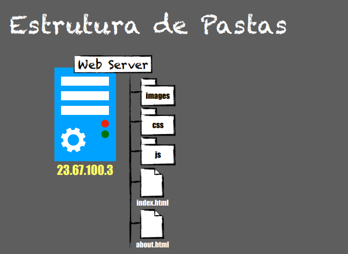
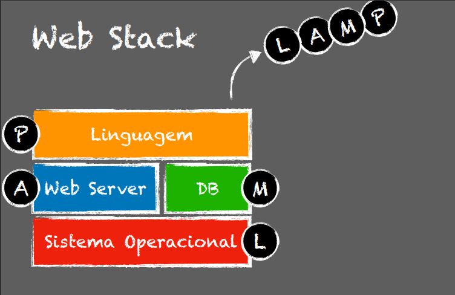

# Servidores Web
**Exemplos**

------
**Web / DNS**

O cliente vai primeiro para o DNS server e com essa requisição feita, ele se encaminha para o web server

-----
**Virtual Hosting**

É um método que os servidores, tais como servidores web, utilizam para hospedar mais de um nome de domínio em um mesmo computador, algumas vezes no mesmo endereço IP.

----
**Estrutura de Pastas**

----
**Web Stack**
