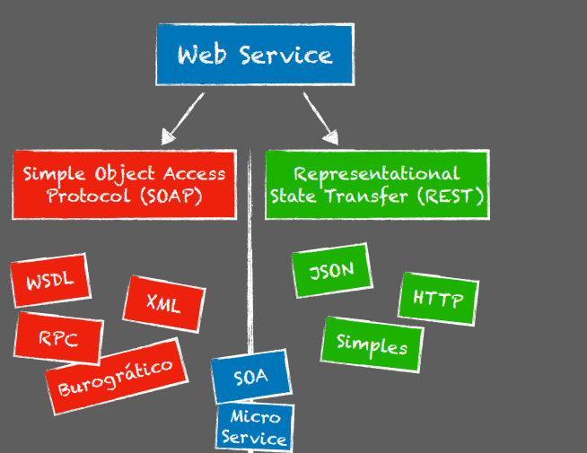
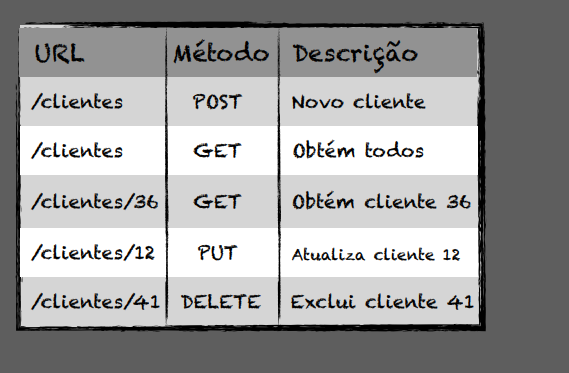

# Web Service
É um serviço que roda em cima de tecnologias da web normalmente essa comunicação os são trafegados de forma textual seja a partir de XML, por exemplo.

SOAP(Simple Object Acess Protocol): versão mais antiga é mais burocrático.
Dentro dele tem: WSDL, XML, RPC, Burocrático
REST(Representational State Transfer): mais simples, leve de trabalhar 
Dentro dele tem: JSON, HTTP, Simples

----------
**Convenções RESTful**

-----------

